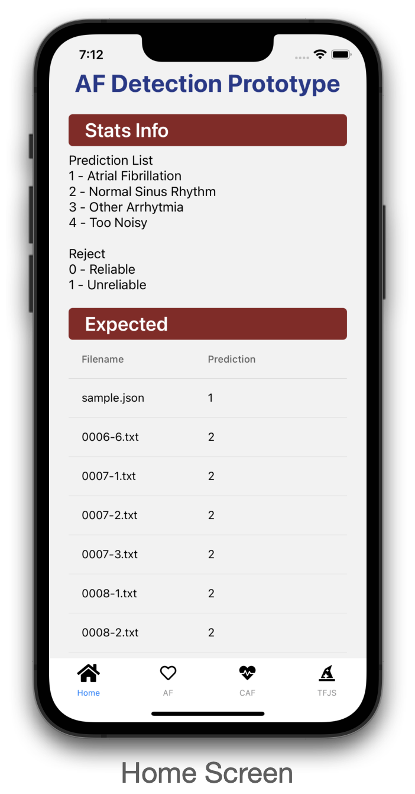
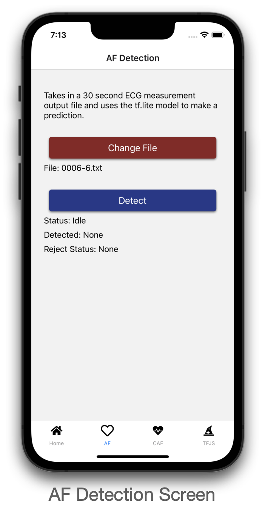
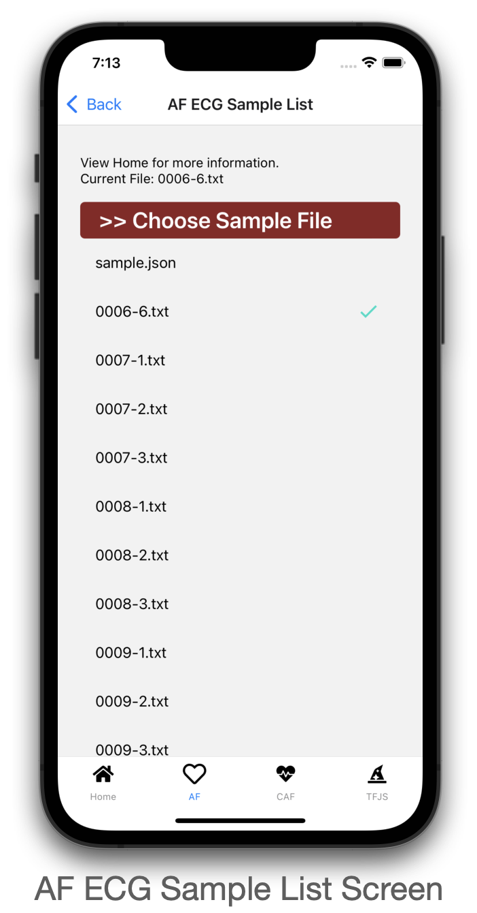
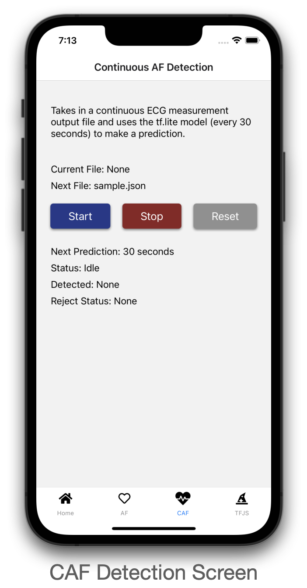
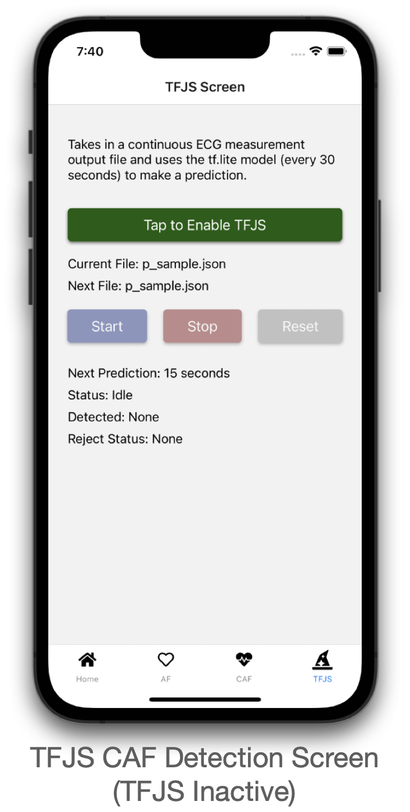
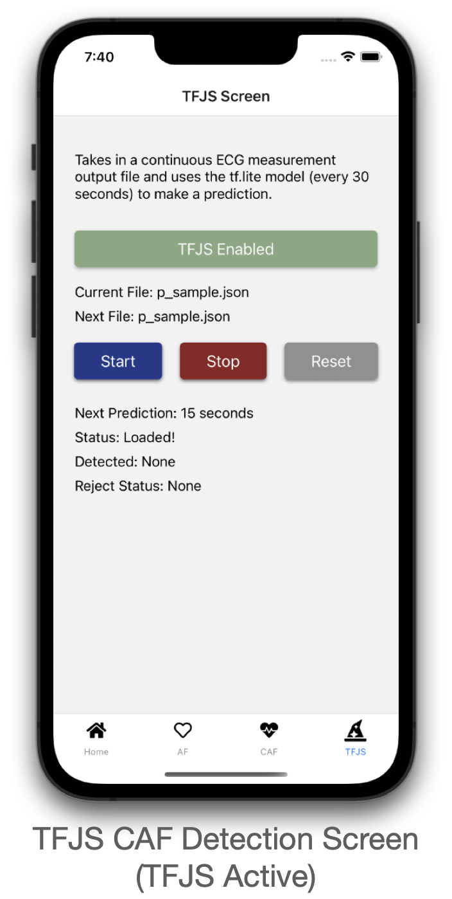

# ts-af (tcc-af-module prototype)
## Description
Prototype of tcc-af-module for tcc-jadeite. Using TFJS library to use TFJS graph model to run in (TypeScript) React Native environment. ECG measurements are classified as either:
- Atrial Fibrillation
- Other Arrhytmias
- Normal Sinus Rhythm
- Too Noisy

## Getting Started

1. in root directory, run `yarn install`
2. go to `/ios`, then run `pod install`
3. run and build app using:
   - iOS: `yarn run ios`
   - Android: `yarn run android` (currently not available due to expo compatibility issues)

## Troubleshooting

If `model.json` or `weights.bin` are missing, please download using the links below:

- [`model.json`](https://1drv.ms/u/s!AhwQNlQ3dXFkiu1spg20zRAjasW2fA?e=fVb1ZT)
- [`weights.bin`](https://1drv.ms/u/s!AhwQNlQ3dXFkiu1tsGK-W9kAmr51jg?e=PrGFXN)

Afterwards, browse to `src/assets/af/graph-model` and put both files in it.

- If `/af` or `/graph-model` folder(s) does not exist, please create one on said directory.

## Screenshots

## Other Links

- [List of sample files](https://github.com/TCC-AF/Samples)
- [AF module in for TCC-Jadeite](https://github.com/unsw-gsbme/tcc-af-module)
- [Prototype (Azure only)](https://github.com/TCC-AF/azure-af/)