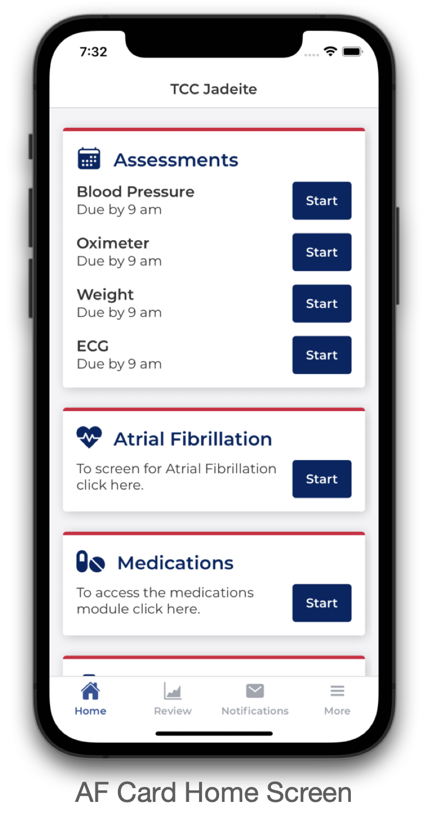
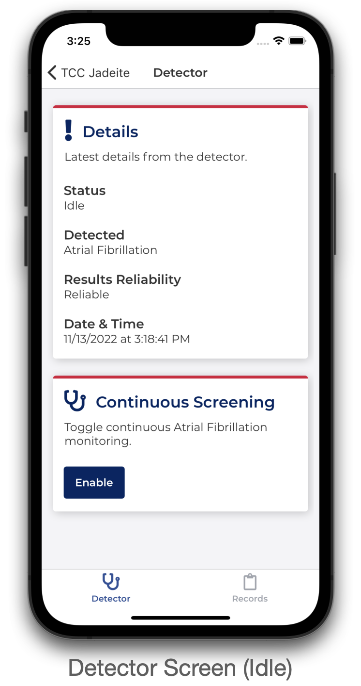
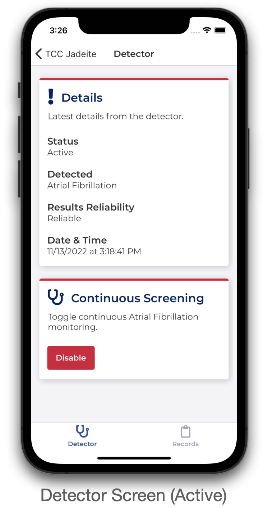
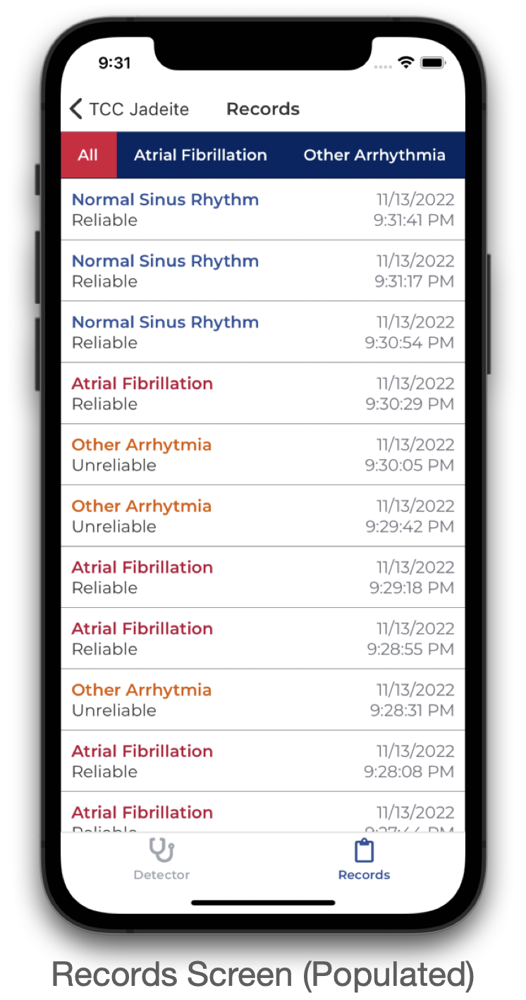
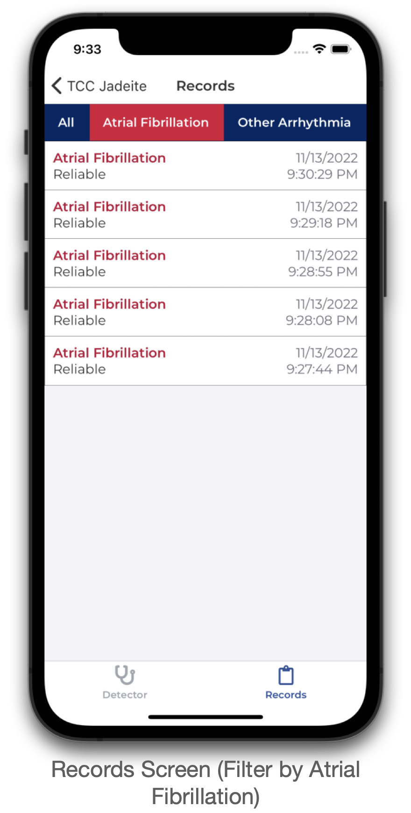
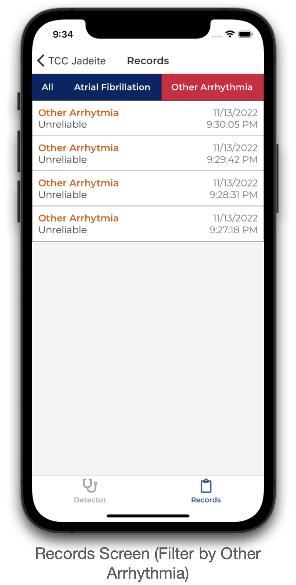
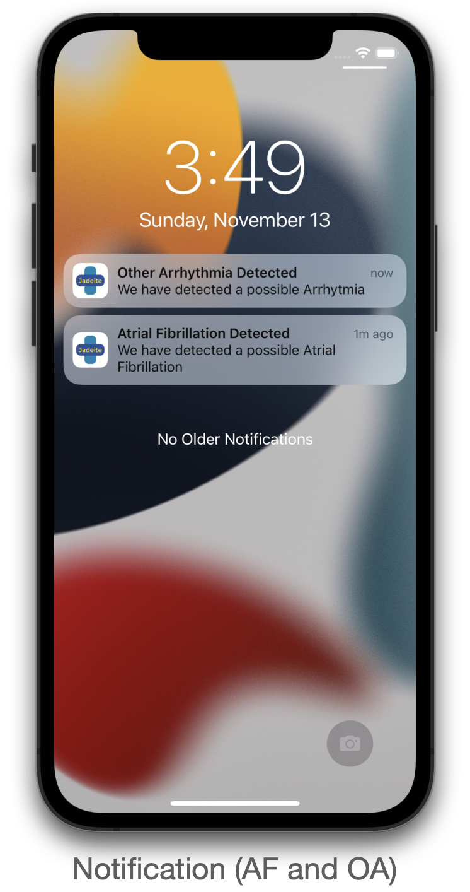

  <ul>
    
<h1 id="ts-af" style="display: inline-block;">Atrial Fibrillation Module</h1>

  </ul>

## Important Declarations
- This is a **prototype**, for final module implemented into TeleClinical Care please visit https://github.com/ItsLame/tcc-af/
- Final module is **not accessible** as it is currently **privated** due to **confidential** reasons, however [screenshots are available below](#screenshots)

## Tables of Contents
- [Description](#description)
- [Screenshots](#screenshots)
- [Getting Started](#getting-started)
- [Troubleshooting](#troubleshooting)
- [Other Links](#other-links)
   - Sample files
   - Azure prototype

## Description
[[Back to top]](#ts-af)

Prototype of tcc-af module for tcc-jadeite. Using TFJS library to use TFJS graph model to run in (TypeScript) React Native environment. ECG measurements are classified as either:
- Atrial Fibrillation
- Other Arrhytmias
- Normal Sinus Rhythm
- Too Noisy

## Screenshots
[[Back to top]](#ts-af)

  
Prototype Screenshots

       

  
Final AF Module in TCC-Jadeite Screenshots

        

## Getting Started
[[Back to top]](#ts-af)

1. in root directory, run `yarn install`
2. go to `/ios`, then run `pod install`
3. run and build app using:
   - iOS: `yarn run ios`
   - Android: `yarn run android` (currently not available due to expo compatibility issues)

## Troubleshooting
[[Back to top]](#ts-af)

If `model.json` or `weights.bin` are missing, please download using the links below:

- [`model.json`](https://1drv.ms/u/s!AhwQNlQ3dXFkiu1spg20zRAjasW2fA?e=fVb1ZT)
- [`weights.bin`](https://1drv.ms/u/s!AhwQNlQ3dXFkiu1tsGK-W9kAmr51jg?e=PrGFXN)

Afterwards, browse to `src/assets/af/graph-model` and put both files in it.

- If `/af` or `/graph-model` folder(s) does not exist, please create one on said directory.

## Other Links
[[Back to top]](#ts-af)

- [ECG sample files](https://github.com/TCC-AF/Samples)
- [Prototype using Azure](https://github.com/TCC-AF/azure-af/)
